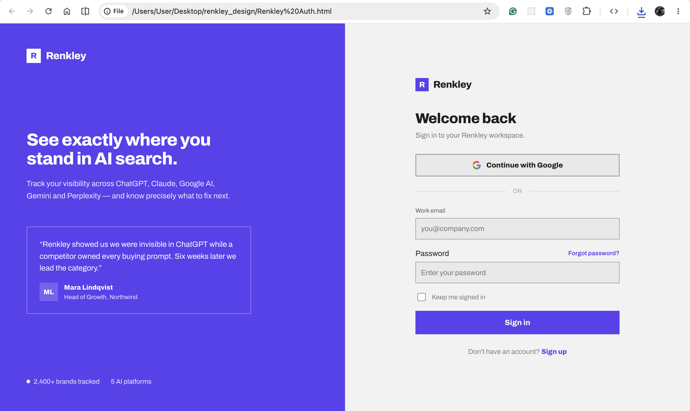
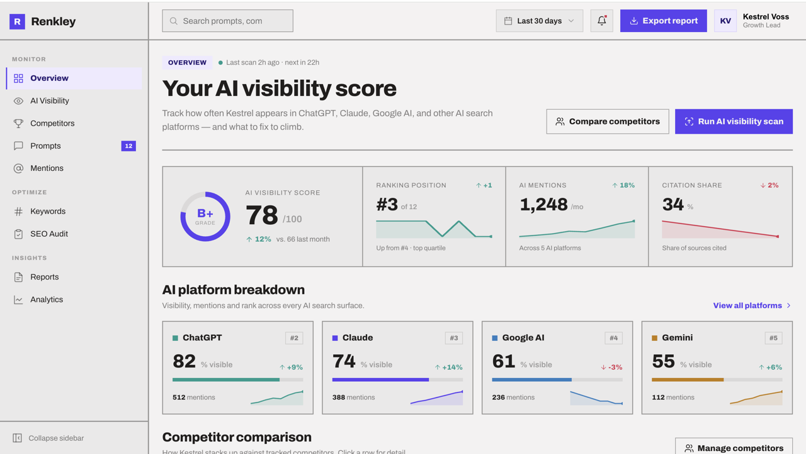

# Renkley

**Your competitors are showing up in ChatGPT. Are you?**

Renkley tracks how often a brand appears across ChatGPT, Claude, and Gemini —
benchmarking competitors, surfacing optimization gaps, and turning AI-search
visibility into actionable recommendations. Built with Rails 8.

## Demo

https://github.com/user-attachments/assets/d53d7b2c-4fe7-4522-bb1d-6c41b3632f9d

A walkthrough of the Overview dashboard. If the player above doesn't render,
open [`public/renkley_design_screens/overview.mp4`](public/renkley_design_screens/overview.mp4)
directly.

## Screens

| Sign in | Overview |
| --- | --- |
|  |  |

See [`docs/design_screens.md`](docs/design_screens.md) for the full gallery,
and [`docs/roadmap.md`](docs/roadmap.md) to see what's actually built and
what's documented-but-not-built.

## Stack

- Ruby 4.0 / Rails 8.1
- PostgreSQL
- Propshaft + dartsass-rails + importmap-rails (no Node build step)
- Stimulus

## Getting started

### Prerequisites

- Ruby 4.0 (see [`.ruby-version`](.ruby-version))
- PostgreSQL running locally on port 5432

### Credentials

Renkley reads its secrets from Rails' encrypted credentials, not `ENV` vars.
Open them with:

```bash
EDITOR="code --wait" bin/rails credentials:edit
```

and fill in:

```yaml
postgres:
  password: your_postgres_password

google:
  client_id: your_client_id
  client_secret: your_client_secret

gemini:
  api_key: your_api_key
  model: gemini-flash-latest
```

- `postgres.password` — password for the local `postgres` role that
  [`config/database.yml`](config/database.yml) connects as.
- `google.client_id` / `client_secret` — OAuth app credentials from the
  [Google Cloud Console](https://console.cloud.google.com/apis/credentials),
  used for "Continue with Google" ([`config/initializers/omniauth.rb`](config/initializers/omniauth.rb)).
- `gemini.api_key` — a [Google AI Studio](https://aistudio.google.com/apikey)
  Gemini API key, used by [`GeminiClient`](app/services/gemini_client.rb) to
  run visibility scans. `model` is optional and defaults to
  `gemini-flash-latest` if omitted.

### Install & run

```bash
bin/setup
```

This installs dependencies, prepares the database, and boots the app. To run
the web server and the Sass watcher together:

```bash
bin/dev
```

### Running tests

```bash
bin/rails test
```

The suite crosses Rails' parallelization threshold (~50 tests) and this
repo's Sass compiler isn't fork-safe, so run it single-process:

```bash
PARALLEL_WORKERS=1 bin/rails test
```

## License

MIT — see [`LICENSE`](LICENSE).

---

## A Note From the Author

One morning, upon waking from dreams that had promised a startup, I found that I had been transformed in my workspace into a collector of waitlisted names,  a small, patient, faintly ridiculous creature whose entire purpose had become the counting of emails that would arrive, and depart, and arrive again, in numbers that meant everything and nothing. I did not choose this transformation; it arrived the way weather arrives, without consultation, and by the time I noticed it I was already accustomed to my new shape.

I want to be precise about what happened, because precision was the one thing my new form still permitted me. Each day I sat before the machine and built a door here, a corridor there, a room whose walls I had painted with great care and would perhaps never furnish,  and each day, when the sun had gone, I understood a little less why I was building it. The work did not stop being possible. It stopped, simply, being mine.

So I did what a reasonable insect does with an unfinished palace: I catalogued it. I gathered the tickets, the requirements, the little bureaucratic slips of intention:  Login. Onboarding. Settings. Overview. I handed them to a stranger, an assistant made of language, and asked it to summarize what I no longer had the will to summarize myself. This, too, felt correct. There is a dignity in leaving good records, even for rooms no one may ever enter.

Some of the rooms are finished;  you may walk through them, and the doors will close properly behind you. Others are not: touch the handle and you will find a sign, apologetic and slightly bureaucratic, informing you that this room is Coming Soon, and if you wander far enough off the corridor entirely, a modest 404 awaits you, not as a punishment but as an honest confession this hallway does not yet exist, and perhaps it never will, and that is being said to you plainly rather than pretended away.

I will not defend the interruption, and I will not apologize for it either. Somewhere in the process of building this  a startup, a waitlist, a promise I noticed that what actually held my attention was not the promise but the tools: the small, exacting, undramatic craft of making things well, and increasingly, I noticed this attention pulling toward Elixir, toward a different shape of work entirely, the way a sleeper turns in the night toward a cooler side of the bed without deciding to. I do not ask you not to judge this. Judge it if you like; I have already made my peace with the judgment, mine and yours both.

One more thing belongs in this record. I did not build this alone. I met my collaborator the way one meets people now, through a professional network, both of us strangers proposing to build something real together,  and she built the part that lets a stranger sign in with a single click of trust, the Google authentication, quietly and correctly, before I disappeared into my own transformation. To her: good luck on the rest of your journey through Rails, wherever it takes you, with or without me.

And to whoever is reading this in a fork, in a curious clone, in an idle hour,  thank you for your interest in a room I stopped building. If you decide to finish it, that would be a fine thing. Take it; it is offered freely, under the MIT [`LICENSE`](LICENSE), asking only the ordinary courtesy of the credit that is due to those of us who built the first rooms, however many of them we managed to finish.
