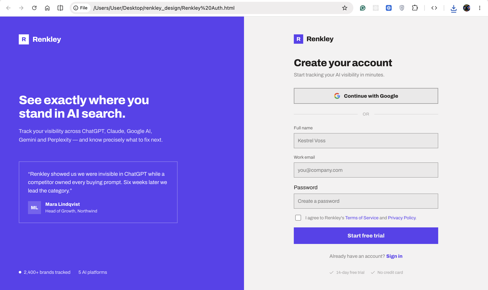
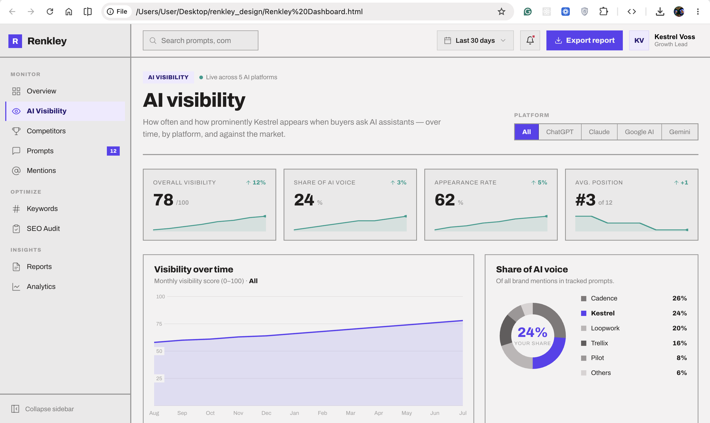
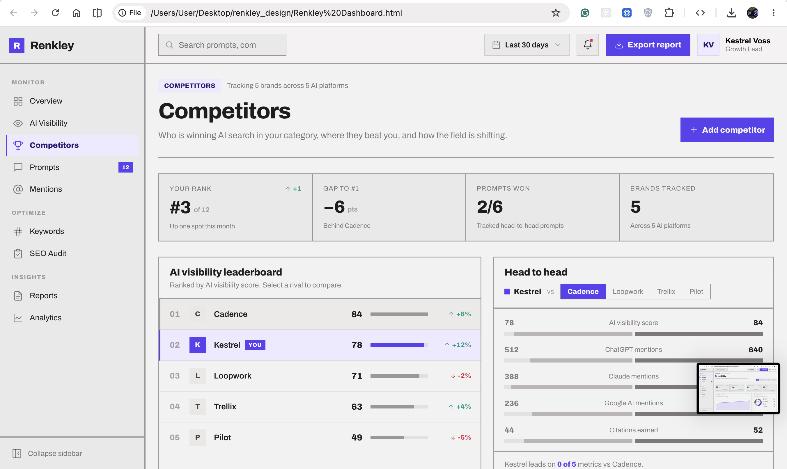
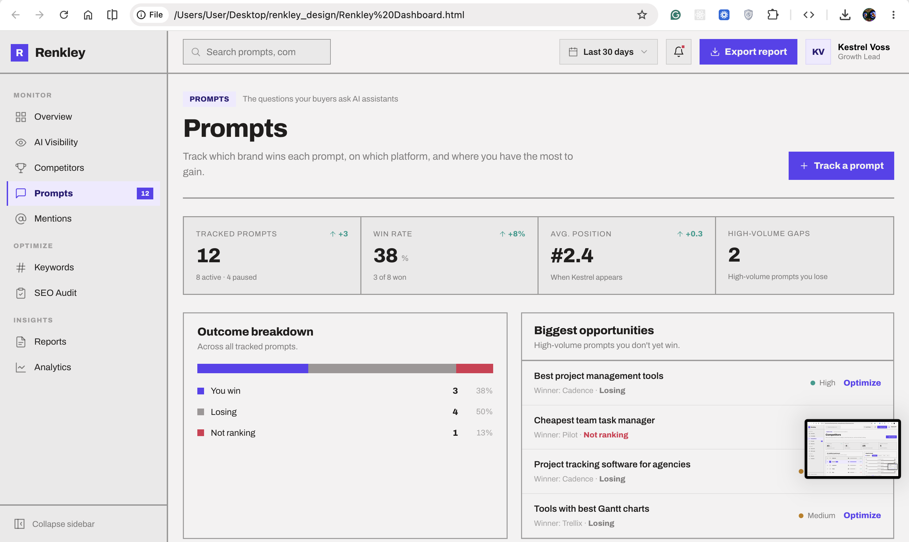
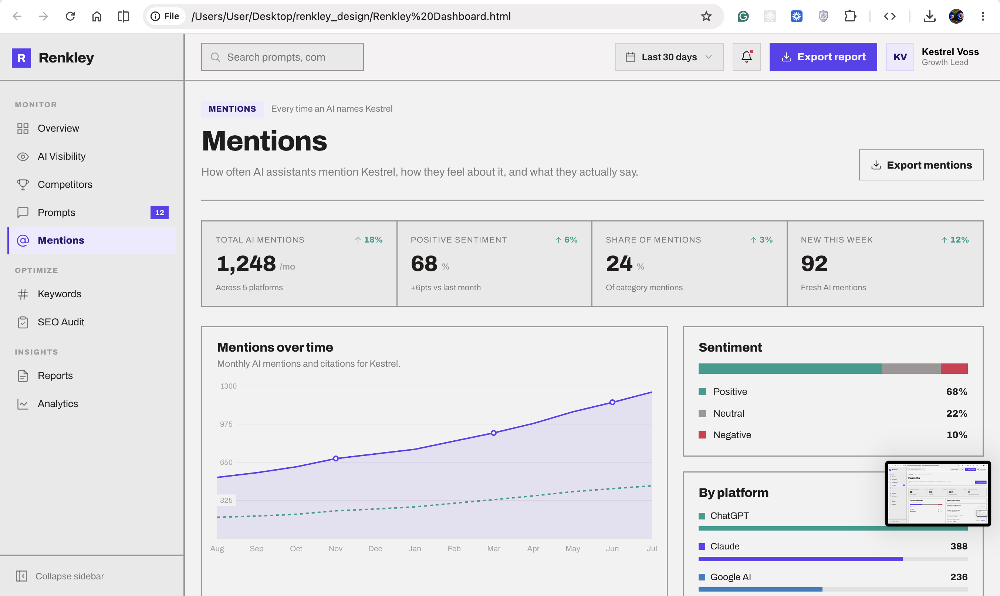
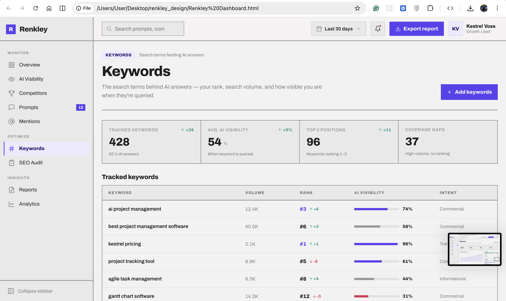
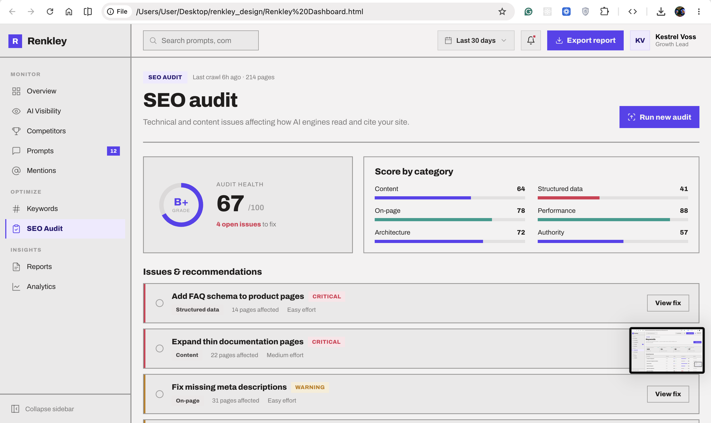
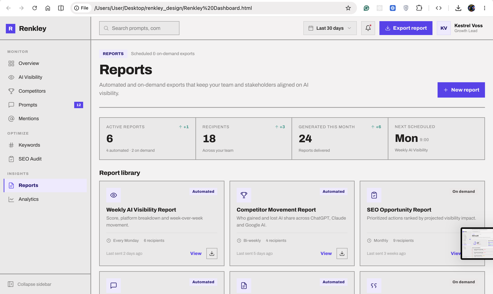
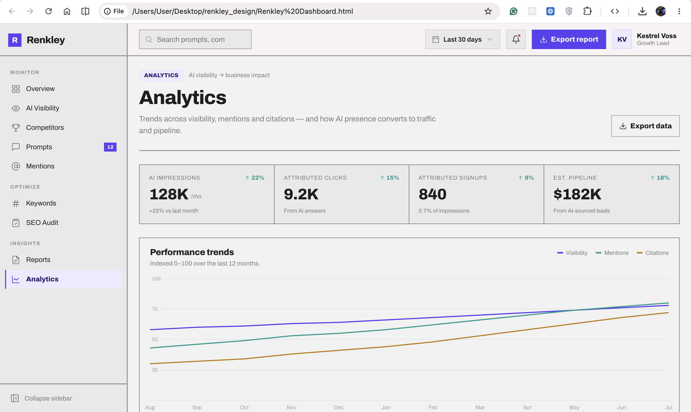

# Design Screens

A visual tour of the screens that exist in Renkley today. Sources live in
[`public/renkley_design_screens`](../public/renkley_design_screens).

See [`roadmap.md`](roadmap.md) for the full list of what's built vs. what's
documented-but-not-built.

## Auth

| Sign in | Sign up |
| --- | --- |
|  |  |

## Dashboard — Overview

## Dashboard — AI Visibility

## Dashboard — Competitors

## Dashboard — Prompts

## Dashboard — Mentions

## Dashboard — Keywords

## Dashboard — SEO Audit

## Dashboard — Reports

## Dashboard — Analytics

